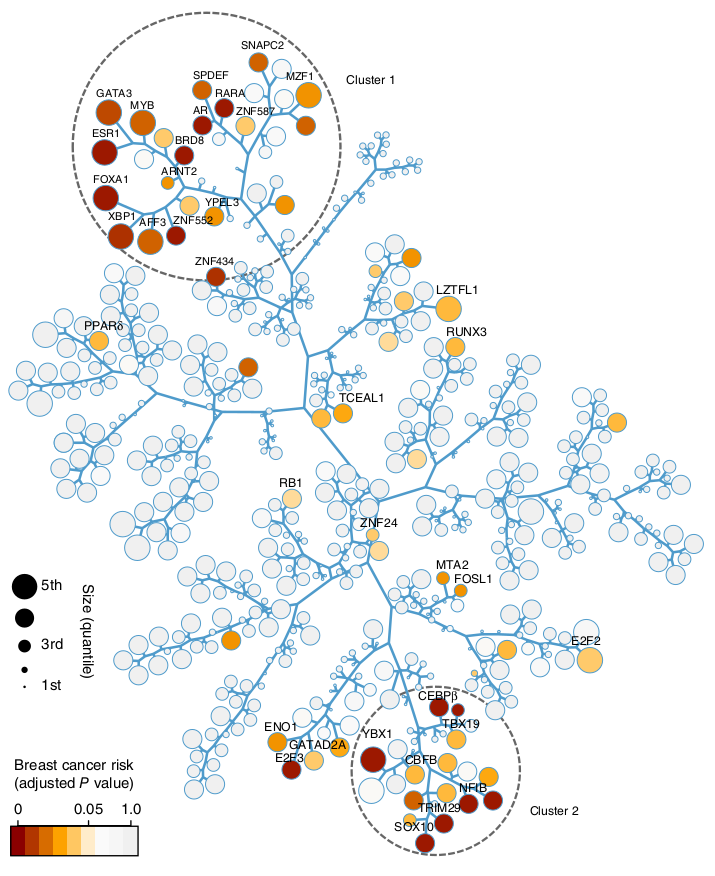

# TreeAndLeaf 
A R package for reorganizing dendrograms and adding additional layers of information.

<p align="center">
  
  
</p>

<p align="center">
Source: Castro, 2015 (http://dx.doi.org/10.1038/ng.3458)
</p>


## Installation
```r
# Install devtools from github
devtools::install_github("leonardokume/TreeAndLeaf")
```

## Quick Start

1 - Call the necessary libraries

```r
library(igraph)
library(RedeR)
library(TreeAndLeaf)
```

2 - Clusterize the data from the dataset "USArrests" and transform it into an igraph object

```r
hc <- hclust(dist(USArrests), "ave")
gg <- hclust2igraph(hc)
```

3 - Set the aliases for the nodes

```r
idx <- match(V(gg$g)$name, rownames(USArrests))
V(gg$g)$nodeAlias <- V(gg$g)$name
V(gg$g)$nodeAlias[is.na(idx)]<-""
```

4 - Here we make some adjustments to the nodes like fonts, color and sizes

```r
# Node font
V(gg$g)$nodeFontSize<-30
V(gg$g)$nodeFontColor<-"red"
V(gg$g)$nodeFontSize[V(gg$g)$nodeAlias==""]<- 1

# Node color
V(gg$g)$nodeColor<-"black"

#Node size
sz <- USArrests$UrbanPop
names(sz) <- rownames(USArrests)
idx <- match(names(sz), V(gg$g)$name)
V(gg$g)$nodeSize[idx] <- sz
V(gg$g)$nodeSize[V(gg$g)$nodeAlias==""] <- 1

# Adjust the edge style
E(gg$g)$edgeWidth <- 18
E(gg$g)$edgeColor<-"black"
```

5 - For the colors we use the RColorBrewer library

```r
# Get the murder data and separate it in six quantiles
murder <- USArrests$Murder
names(murder) <- rownames(USArrests)
qnts <- quantile(murder, seq(0, 1, 0.2))

# Use the RColorBrewer library to make a pallete using the quantiles
library(RColorBrewer)
pal <- brewer.pal(5, "Reds")
col <- murder
col[murder < qnts[2]] <- pal[1]
col[murder >= qnts[2] & murder < qnts[3]] <- pal[2]
col[murder >= qnts[3] & murder < qnts[4]] <- pal[3]
col[murder >= qnts[4] & murder < qnts[5]] <- pal[4]
col[murder >= qnts[5] & murder <= qnts[6]] <- pal[5]

# Match the color pallete to the correct states
idx <- match(names(col), V(gg$g)$nodeAlias)
V(gg$g)$nodeColor[idx] <- col
```

6 -  Create the legends to be added to RedeR
```r
# Colors
qnts <- round(qnts)
col_leg <- NULL
for(i in 2:(length(qnts)) - 1) {
    col_leg[i] <- paste(qnts[i], " - ", qnts[i+1])
}

# Sizes
min <- signif(min(sz), digits = 0)
max <- signif(max(sz), digits = 0)
leg <- seq(min, max, length.out = 4)
```

7 - Call the RedeR interface and add the legends

```r
rdp <- RedPort()
calld(rdp)

# Add the legends
addLegend.color(rdp, pal, labvec = col_leg, type = "node",
                title = "Murder Rate", position = "right")

addLegend.size(rdp, leg, type = "node", title = "Urban Population Size",
               position = "bottomright")
```

8 - Make the TreeAndLeaf layout and use the relaxation algorithm from RedeR

```r
layout <- treeAndLeaf(gg$g, size = "small")
addGraph(rdp, gg$g, layout = layout, zoom = 20)
relax(rdp, p1 = 50, p2 = 100, p3 = 50, p4 = 100, p5 = 100, p8 = 40)
```
<p align="center">

</p>

```
At this stage the image produced needs small ajustments to solve the residual edge crossings.
You can just click and drag a node to ajust it while the relaxation algorithm is still running.
```

9 - After this first relaxation, you can make manual adjustments to the layout and then relax again to condense the nodes

```{r, eval=FALSE}
relax(rdp, p1 = 20, p3 = 30, p5 = 10, p8 = 30)
```
<p align="center">

</p>
